#### <mark style="background: #FFB86CA6;">**argparse.ArgumentParser(description="...")**</mark> - <mark style="background: #ABF7F7A6;">`init parser`</mark> - tworzy obiekt parsera; `description` dodaje opis programu widoczny przy wywołaniu pomocy (`-h`)

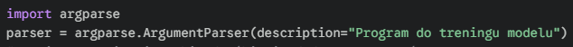

---

#### <mark style="background: #FFB86CA6;">**parser.parse_args()**</mark> - <mark style="background: #ABF7F7A6;">`execute parsing`</mark> - pobiera argumenty z terminala, przetwarza je i zwraca jako obiekt, w którym argumenty są atrybutami (np. `args.filename`)

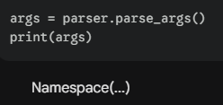

---

#### <mark style="background: #FFB86CA6;">**parser.add_argument("name")**</mark> - <mark style="background: #ABF7F7A6;">`positional argument`</mark> - argument **wymagany**, bez myślników; kolejność podawania ma znaczenie (np. ścieżka do pliku wejściowego)

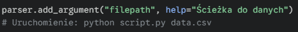

---

#### <mark style="background: #FFB86CA6;">**parser.add_argument("-f", "--flag")**</mark> - <mark style="background: #ABF7F7A6;">`optional argument`</mark> - argument opcjonalny (flaga); używa myślników; można podać nazwę krótką (`-e`) i długą (`--epochs`)

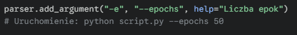

---

#### <mark style="background: #FFB86CA6;">**type=int / float**</mark> - <mark style="background: #ABF7F7A6;">`type conversion`</mark> - automatycznie konwertuje wejście (które domyślnie jest stringiem) na liczbę; zgłasza błąd, jeśli typ się nie zgadza

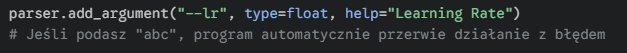

---

#### <mark style="background: #FFB86CA6;">**default=value**</mark> - <mark style="background: #ABF7F7A6;">`default value`</mark> - wartość, która zostanie przypisana do zmiennej, jeśli użytkownik nie poda argumentu w terminalu

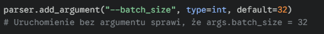

---

#### <mark style="background: #FFB86CA6;">**choices=[...]** </mark>- <mark style="background: #ABF7F7A6;">`restrict choices`</mark> - wymusza na użytkowniku wybór jednej wartości ze ściśle określonej listy

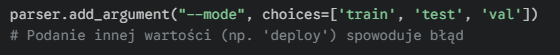

---

#### <mark style="background: #FFB86CA6;">**action="store_true"**</mark> - <mark style="background: #ABF7F7A6;">`boolean flag`</mark> - działa jak przełącznik; nie pobiera żadnej wartości po sobie. Jeśli flaga jest obecna -> `True`, brak flagi -> `False` (lub odwrotnie dla `store_false`)

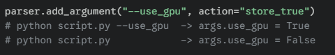

---

#### *<mark style="background: #FFB86CA6;">*nargs="+"**</mark> - <mark style="background: #ABF7F7A6;">`gather arguments`</mark> - pozwala argumentowi przyjąć **!!! listę !!!** wartości (jeden lub więcej); przydatne np. przy podawaniu wielu plików do przetworzenia

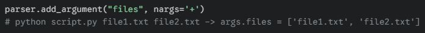

---

#### <mark style="background: #FFB86CA6;">**metavar="NAME"**</mark> - <mark style="background: #ABF7F7A6;">`display name`</mark> - zmienia nazwę argumentu wyświetlaną w komunikacie pomocy (`-h`), co poprawia czytelność dokumentacji (nie wpływa na nazwę zmiennej w kodzie)

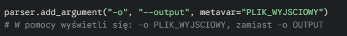

---

#### <mark style="background: #FFB86CA6;">**required=True**</mark> - <mark style="background: #ABF7F7A6;">`mandatory flag`</mark> - zmienia argument opcjonalny (ten z myślnikami `--`) w **obowiązkowy**. Jeśli użytkownik go nie poda, program nie ruszy. To kluczowe, gdy np. ścieżka do modelu nie jest pozycyjna, ale _musi_ być podana

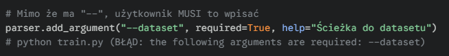

---

#### <mark style="background: #FFB86CA6;">**parser.add_mutually_exclusive_group()**</mark> - <mark style="background: #ABF7F7A6;">`exclusive options`</mark> - tworzy grupę, w której użytkownik może wybrać **tylko jedną** opcję. Przydatne, gdy opcje się gryzą (np. "tryb cichy" vs "tryb gadatliwy")

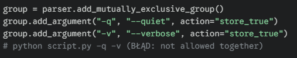

---

#### <mark style="background: #FFB86CA6;">**help="opis"**</mark> - <mark style="background: #ABF7F7A6;">`documentation string`</mark> - tekst, który wyświetla się użytkownikowi po wpisaniu flagi `-h`. Dla Juniora MLE to obowiązek – opisz, co robi dany hiperparametr.

---

#### <mark style="background: #FFB86CA6;">**vars(args)**</mark> - <mark style="background: #ABF7F7A6;">`namespace to dict`</mark> - zamienia obiekt z argumentami na zwykły słownik Pythonowy. Jest to **super przydatne w ML**, np. do logowania wszystkich hiperparametrów do MLflow lub WandB jednym rzutem.

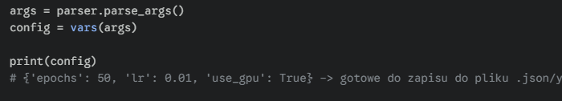

---

#### <mark style="background: #FFB86CA6;">**nargs="?"**</mark> - <mark style="background: #ABF7F7A6;">`optional value`</mark> - argument może przyjąć wartość, ale nie musi. Jeśli nie przyjmie, bierze wartość z parametru `const`. (Rzadziej używane przez Juniorów niż `default`, ale warto odnotować).

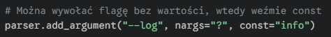

---

#### <mark style="background: #FFB86CA6;">**dest="name"**</mark> - <mark style="background: #ABF7F7A6;">`destination variable`</mark> - pozwala ręcznie określić nazwę zmiennej, pod którą zapisany zostanie argument. Domyślnie `argparse` bierze nazwę z flagi (zamieniając `--my-flag` na `my_flag`), ale czasem chcesz skrócić nazwę w kodzie.

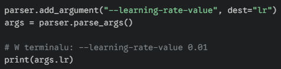

---

#### <mark style="background: #FFB86CA6;">**action="version"**</mark> - <mark style="background: #ABF7F7A6;">`version info`</mark> - specjalna akcja, która wyświetla wersję programu i natychmiast kończy jego działanie. Standard w profesjonalnych narzędziach CLI. Wymaga podania parametru `version`.

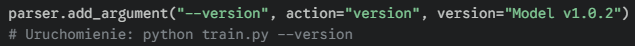

---

#### <mark style="background: #FFB86CA6;">**parser.parse_args(lista_stringow)**</mark> - <mark style="background: #ABF7F7A6;">`manual testing`</mark> - to **nie jest parametr**, ale sposób użycia metody. Zamiast czytać z terminala, możesz podać listę ręcznie w kodzie. Jest to **absolutnie kluczowe dla Juniora przy pisaniu Unit Testów** lub debugowaniu w Jupyter Notebooku, gdzie nie masz prawdziwej linii komend.

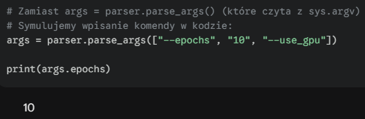

---

#### <mark style="background: #FFB86CA6;">**nargs='*’**</mark> - <mark style="background: #ABF7F7A6;">`zero or more`</mark> - argument jest opcjonalny i może przyjąć dowolną liczbę wartości (lub żadnej); zwraca pustą listę, jeśli argumenty nie zostały podane

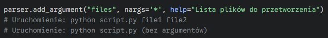

---

#### <mark style="background: #FFB86CA6;">**action="append"**</mark> - <mark style="background: #ABF7F7A6;">`append to list`</mark> - pozwala użyć tej samej flagi wielokrotnie, a wartości trafiają do listy.

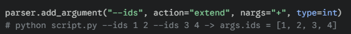

---

#### <mark style="background: #FFB86CA6;">**action="extend"**</mark> - <mark style="background: #ABF7F7A6;">`extend list`</mark> - pozwala dodać wiele wartości do jednej listy, nawet jeśli są podawane osobno. Różni się od `append` tym, że spłaszcza strukturę listy (nie tworzy listy list).

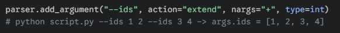

---

#### <mark style="background: #FFB86CA6;">**argparse.SUPPRESS**</mark> - <mark style="background: #ABF7F7A6;">`hide argument`</mark> - pozwala całkowicie ukryć argument w komunikacie pomocy (`-h`). Użytkownik może go użyć, ale nie zobaczy go na liście dostępnych opcji.

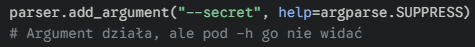

---

#### <mark style="background: #FFB86CA6;">**action="store_const"**</mark> - <mark style="background: #ABF7F7A6;">`store constant value`</mark> - jeśli flaga zostanie użyta, przypisuje do zmiennej konkretną wartość (np. liczbę 15), którą zdefiniujesz w parametrze `const`.

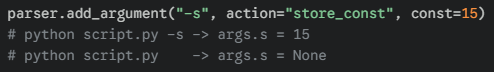

---

#### <mark style="background: #FFB86CA6;">**action="append_const"**</mark> - <mark style="background: #ABF7F7A6;">`append constant`</mark> - działa jak `append` (tworzy listę), ale nie pobiera wartości od użytkownika, tylko dodaje do listy zdefiniowaną stałą za każdym razem, gdy flaga jest użyta.

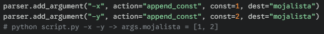

---

#### <mark style="background: #FFB86CA6;">**type=datetime...**</mark> - <mark style="background: #ABF7F7A6;">`custom class method`</mark> - konkretny przykład użycia metody klasy `datetime` jako walidatora typu. To ważny przykład dla Juniora, pokazujący, że `type` to nie tylko `int` czy `str`.

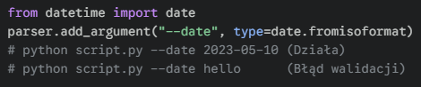

---

#### <mark style="background: #FFB86CA6;">**nargs=INT**</mark> - <mark style="background: #ABF7F7A6;">`fixed number of arguments`</mark> - wymusza podanie **dokładnie określonej liczby** argumentów. W wideo Fabio pokazuje przykład z `nargs=2` dla dwóch nazw plików. Wynik jest zapisywany jako lista.

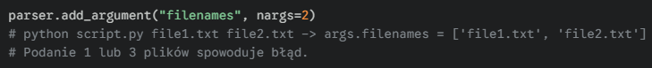

---

#### <mark style="background: #FFB86CA6;">**nargs="?"</mark> z parametrem <mark style="background: #FFB86CA6;">const</mark>** - <mark style="background: #ABF7F7A6;">`optional consumption`</mark> - to jest najbardziej skomplikowany wariant pokazany w filmie. Argument może wystąpić, ale nie musi mieć wartości.

1. Brak flagi -> bierze `default`.
    
2. Flaga bez wartości -> bierze `const`.
    
3. Flaga z wartością -> bierze wartość.

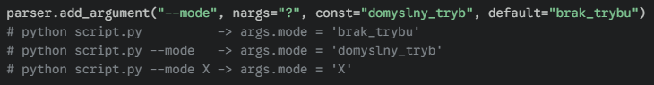

---

