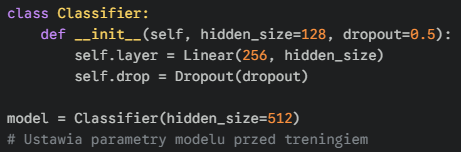
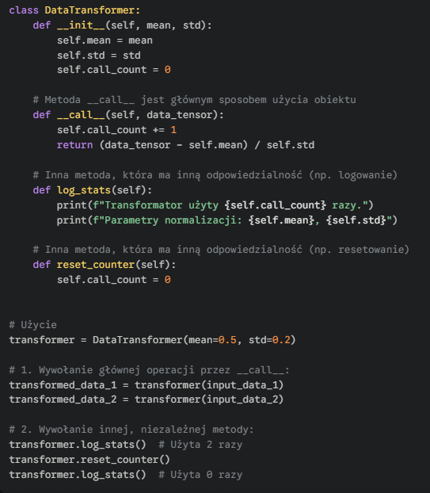
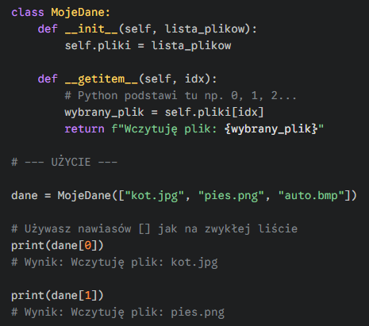
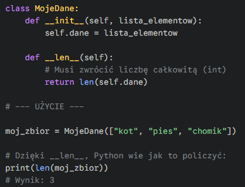
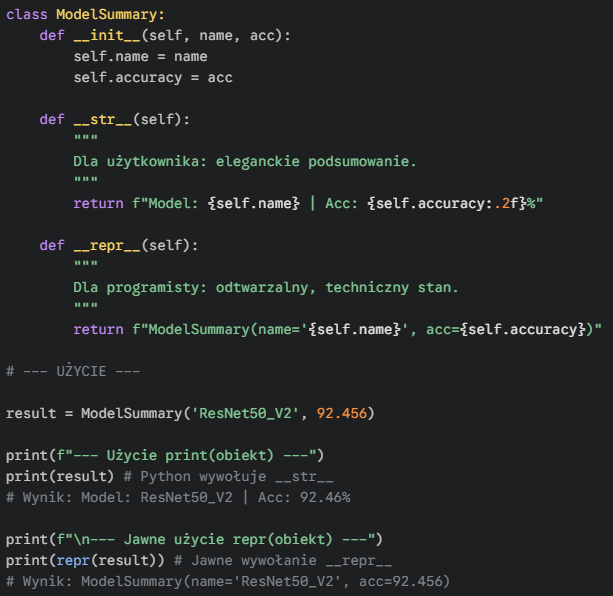
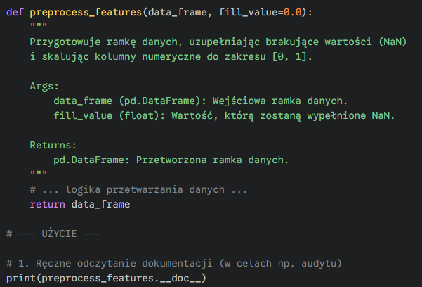
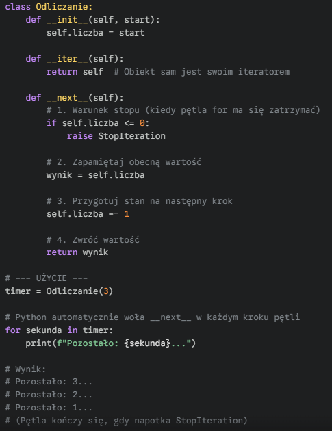
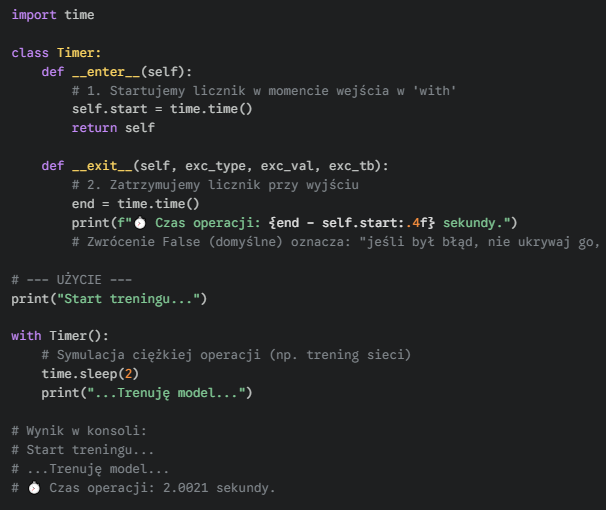

#### <mark style="background: #FFB86CA6;">**__init__**</mark> – <mark style="background: #ABF7F7A6;">`Konstruktor / Inicjalizacja`</mark> – Uruchamia się przy tworzeniu obiektu. W ML jest to standardowe miejsce na definicję architektury sieci (warstw) lub przypisanie hiperparametrów eksperymentu.

---

#### <mark style="background: #FFB86CA6;">**__call__**</mark> – <mark style="background: #ABF7F7A6;">`Wykonywalny obiekt (Callable)`</mark> – Pozwala używać instancji klasy jak zwykłej funkcji. W bibliotekach takich jak PyTorch czy Keras odpowiada za "Forward Pass". Dzięki temu piszemy czysto `model(x)` zamiast `model.predict(x)`.

---

#### <mark style="background: #FFB86CA6;">**def __getitem__(self, idx)**</mark> – <mark style="background: #ABF7F7A6;">`Dostęp przez Indeks`</mark> – Pozwala "wyciągać" elementy z obiektu za pomocą nawiasów kwadratowych `[]`. Python przekazuje do tej metody liczbę (indeks), a Ty definiujesz, co ma zostać zwrócone.

---

#### <mark style="background: #FFB86CA6;">**def __len__(self)**</mark> – <mark style="background: #ABF7F7A6;">`Rozmiar Datasetu (Dataset Size)`</mark> – Metoda ta informuje, ile próbek znajduje się w Twoim zbiorze danych.

---

#### <mark style="background: #FFB86CA6;">**__repr__**</mark> – <mark style="background: #ABF7F7A6;">`Reprezentacja developerska`</mark> – Zwraca jednoznaczny, techniczny opis obiektu. W MLOps jest kluczowy przy logowaniu błędów i konfiguracji eksperymentów, aby w logach widzieć konkrety zamiast `<Object at 0x7f...>`, co nic nie mówi.

#### <mark style="background: #FFB86CA6;">**__str__**</mark> – <mark style="background: #ABF7F7A6;">`Reprezentacja dla użytkownika`</mark> – Zwraca jednoznaczny, opis obiektu przyjazny dla użytkownika, zamiast `<Object at 0x7f...>`, co nic nie mówi.

---

#### <mark style="background: #FFB86CA6;">**__doc__**</mark> – <mark style="background: #ABF7F7A6;">`Dokumentacja (Docstring)`</mark> – Przechowuje opis funkcji/klasy. W inżynierii ML ważne dla utrzymania porządku w pipeline'ach przetwarzania danych, aby inni (lub Ty za miesiąc) wiedzieli, co robi dany transformator.

---

#### <mark style="background: #FFB86CA6;">**iter / next**</mark> – <mark style="background: #ABF7F7A6;">`Iterowalność / Streaming Danych`</mark> – Umożliwia iterowanie po obiekcie (np. w pętli `for`). W ML kluczowe przy pracy z **dużymi zbiorami danych**, które nie mieszczą się w RAM. Zamiast ładować całą tablicę naraz, wczytujesz dane partiami (batches) "w locie".

---

#### <mark style="background: #FFB86CA6;">**enter / exit**</mark> – <mark style="background: #ABF7F7A6;">`Context Manager / Zarządzanie Zasobami`</mark> – Obsługuje logikę bloku `with`. W MLOps niezbędne do bezpiecznego zarządzania zasobami (zamykanie plików, sesji DB, zwalnianie pamięci GPU) lub tworzenia narzędzi monitorujących (np. liczniki czasu treningu). Gwarantuje "posprzątanie" nawet, jeśli wystąpi błąd.

---