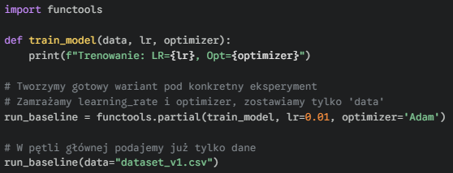

#### <mark style="background: #FFB86CA6;">**functools.partial()**</mark> – <mark style="background: #ABF7F7A6;">`zarządzanie eksperymentami`</mark> – tworzy nową wersję funkcji z "zamrożonymi" niektórymi argumentami. Pozwala przygotować gotowe warianty funkcji trenujących (np. z ustalonymi hiperparametrami), co czyści kod w pipeline'ach i pętlach eksperymentalnych.

---

