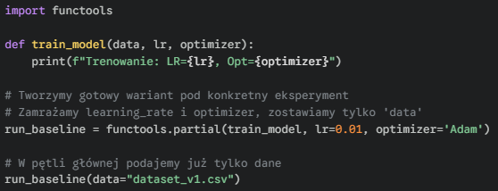
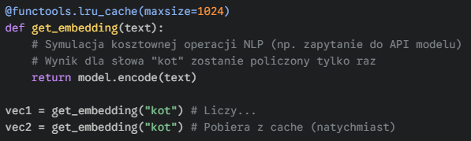
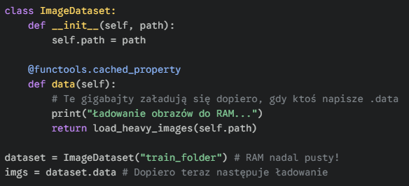
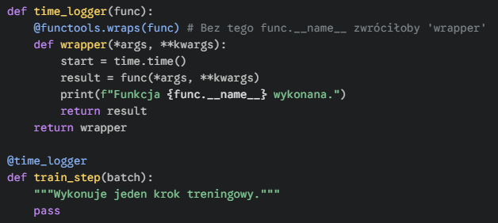
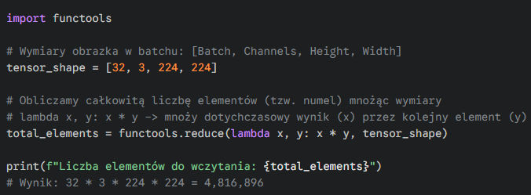

#### <mark style="background: #FFB86CA6;">**functools.partial()**</mark> – <mark style="background: #ABF7F7A6;">`zarządzanie eksperymentami`</mark> – tworzy nową wersję funkcji z "zamrożonymi" niektórymi argumentami. Pozwala przygotować gotowe warianty funkcji trenujących (np. z ustalonymi hiperparametrami), co czyści kod w pipeline'ach i pętlach eksperymentalnych.

---

#### <mark style="background: #FFB86CA6;">**@functools.lru_cache()**</mark> – <mark style="background: #ABF7F7A6;">`optymalizacja / cache`</mark> – zapamiętuje wyniki funkcji dla danych argumentów w pamięci RAM. Kluczowe przy preprocessingu tekstu lub feature engineeringu, aby nie przeliczać wielokrotnie tych samych operacji (np. embeddingów, tokenizacji) dla powtarzających się próbek.

---

#### <mark style="background: #FFB86CA6;">**@functools.cached_property**</mark> – <mark style="background: #ABF7F7A6;">`lazy loading`</mark> – zamienia metodę w atrybut, który oblicza się tylko raz przy pierwszym użyciu. Idealne w klasach typu `Dataset` lub `ModelWrapper`, aby nie ładować ciężkich plików (CSV, wagi modelu) do RAM-u w momencie inicjalizacji obiektu (`__init__`), lecz dopiero gdy są faktycznie potrzebne.

---

#### <mark style="background: #FFB86CA6;">**@functools.wraps()**</mark> – <mark style="background: #ABF7F7A6;">`clean code / debugging`</mark> – dekorator naprawiający metadane funkcji (nazwę, docstring), które giną przy tworzeniu własnych dekoratorów. Niezbędne, gdy piszesz własne narzędzia do mierzenia czasu treningu lub logowania błędów, aby debugger i logi pokazywały `train_step`, a nie `wrapper`.

---

#### <mark style="background: #FFB86CA6;">**functools.reduce()**</mark> – <mark style="background: #ABF7F7A6;">`agregacja / pipeline`</mark> – aplikuje funkcję do elementów sekwencji narastająco, redukując je do jednego wyniku. W ML kluczowe do **składania funkcji (function composition)** – pozwala dynamicznie budować potoki preprocessingu, przepuszczając dane sekwencyjnie przez listę transformacji, bez pisania wielopiętrowych zagnieżdżeń.

---