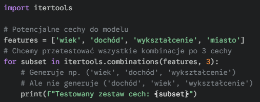
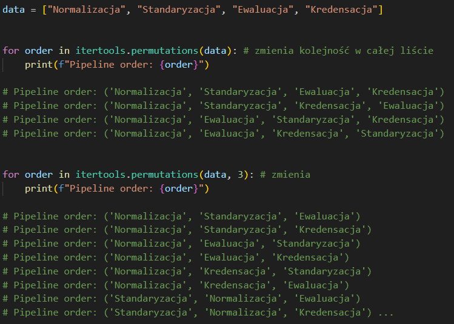
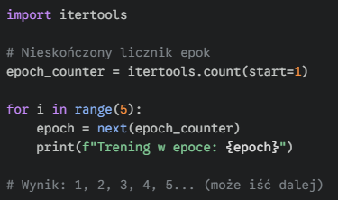
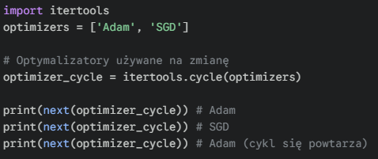
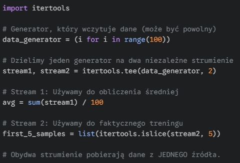
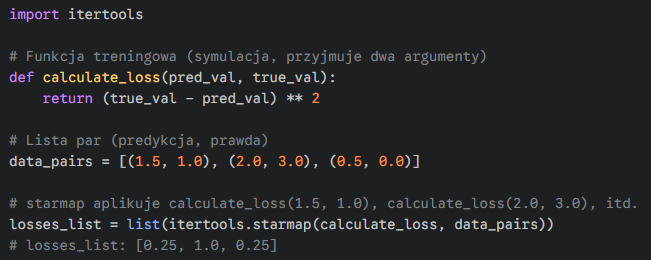

#### <mark style="background: #FFB86CA6;">**itertools.product()**</mark> – <mark style="background: #ABF7F7A6;">`grid search`</mark> – generuje iloczyn kartezjański (wszystkie możliwe kombinacje) sekwencji wejściowych. W ML jest standardem przy tworzeniu siatki hiperparametrów do przetestowania

---

#### <mark style="background: #FFB86CA6;">**itertools.chain()**</mark> – <mark style="background: #ABF7F7A6;">`data streaming`</mark> – łączy wiele iteratorów w jeden ciągły strumień. Pozwala iterować po danych z wielu plików (np. partycji CSV) sekwencyjnie, bez ładowania ich wszystkich naraz do pamięci RAM

---

#### <mark style="background: #FFB86CA6;">**itertools.islice()**</mark> – <mark style="background: #ABF7F7A6;">`mini-batching`</mark> – zwraca wycinek z iteratora na podstawie indeksów (start, stop, krok). Używane do pobierania określonej liczby próbek z generatora danych (np. stworzenie jednego batcha) bez wczytywania reszty datasetu

---

#### <mark style="background: #FFB86CA6;">**itertools.zip_longest()**</mark> – <mark style="background: #ABF7F7A6;">`padding sequences`</mark> – łączy iteratory o nierównej długości, wypełniając braki zdefiniowaną wartością (`fillvalue`). Niezbędne przy przetwarzaniu sekwencji (NLP, Time Series), gdy musimy wyrównać długość wektorów

---

#### <mark style="background: #FFB86CA6;">**itertools.groupby()**</mark> – <mark style="background: #ABF7F7A6;">`preprocessing`</mark> – grupuje kolejne elementy iteratora, które mają ten sam klucz. Wymaga posortowanych danych. Przydatne np. do grupowania logów użytkownika w sesje przed podaniem ich do modelu.

---

#### <mark style="background: #FFB86CA6;">**itertools.combinations(iterable, r)**</mark> – <mark style="background: #ABF7F7A6;">`nieuporządkowany wybór`</mark> – Generuje wszystkie możliwe, unikatowe podzbiory o długości `r`. Kolejność elementów wewnątrz podzbioru jest **ignorowana** ([A, B] == [B, A], zwróci tylko jeden przypadek).

##### **ISTOTNE DLA MLE:** Służy do tworzenia zestawów cech (feature selection) lub dyskretnych kombinacji hiperparametrów, gdy kolejność ich podawania do modelu nie ma znaczenia.

---

#### <mark style="background: #FFB86CA6;">**itertools.permutations(iterable, r)**</mark> – <mark style="background: #ABF7F7A6;">`uporządkowany wybór`</mark> – Generuje wszystkie możliwe **uporządkowane** sekwencje o długości `r`. Kolejność elementów jest **kluczowa**.

##### **ISTOTNE DLA MLE:** Rzadziej używane niż `combinations`, ale przydatne do testowania kolejności procesów (np. kolejności preprocesorów w pipeline'ie) lub w zadaniach rankingowych, gdzie kolejność ma wpływ na wynik.

---

#### <mark style="background: #FFB86CA6;">**itertools.count(start=0, step=1)**</mark> – <mark style="background: #ABF7F7A6;">`nieskończony licznik`</mark> – Zwraca iterator, który generuje nieskończoną sekwencję równo oddalonych liczb, zaczynając od `start`.

##### **ISTOTNE DLA MLE:** Idealne do tworzenia własnych liczników epok lub indeksowania w nieskończonych data loaderach/generatorach, zastępując `while True` bezpiecznym iteratorem.

---

#### <mark style="background: #FFB86CA6;">**itertools.cycle(iterable)**</mark> – <mark style="background: #ABF7F7A6;">`nieskończone powtarzanie`</mark> – Zwraca iterator, który nieskończenie powtarza elementy z wejściowego obiektu iterowalnego, odtwarzając sekwencję po jej wyczerpaniu.

##### **ISTOTNE DLA MLE:** Stosowane do cyklicznego wykorzystywania małych list konfiguracyjnych w długim procesie (np. rotacja optymalizatorów, cykliczne użycie małego zestawu danych testowych).

---

#### **itertools.tee(iterable, n=2)** – `rozdzielenie strumienia` – Zwraca `n` niezależnych iteratorów z pojedynczego wejściowego iteratora.

##### **ISTOTNE DLA MLE (MEGA ISTOTNE!):** Iterator, raz użyty, zużywa dane. Jeśli potrzebujesz przetworzyć dane z generatora na dwa sposoby (np. raz do logowania statystyk, a raz do faktycznego treningu), bez `tee` musiałbyś uruchomić generator dwukrotnie. `tee` pozwala rozdzielić JEDEN strumień na kilka, oszczędzając czas i zasoby. **Ostrzeżenie o Pamięci:** `tee` buforuje dane. Jeśli zaczniesz konsumować jeden iterator (`iter1`) dużo szybciej niż drugi (`iter2`), system **przechowa w pamięci RAM** wszystkie elementy "zjedzone" przez `iter1`, czekając na `iter2`. Na dużych datasetach prowadzi to do błędu Out-Of-Memory (OOM).

---

#### <mark style="background: #FFB86CA6;">**itertools.starmap(function, iterable)**</mark> – <mark style="background: #ABF7F7A6;">`rozpakowane mapowanie`</mark> – Zwraca iterator, który aplikuje zadaną `function` na elementy wejściowego `iterable`, **rozpakowując (`*`) każdy element** (który musi być krotką lub listą argumentów) i przekazując go jako oddzielne argumenty do funkcji.

##### **ISTOTNE DLA MLE:** Umożliwia wektorowe, wydajne aplikowanie funkcji (np. potęgowania, sumowania, odległości) na listach parametrów lub współrzędnych bez tworzenia dużych list pośrednich. Idealne do aplikowania funkcji treningowej na listach konfiguracji.

---