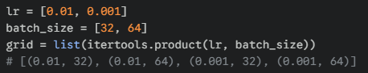
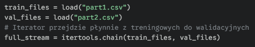
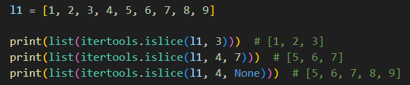
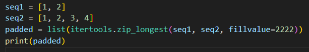
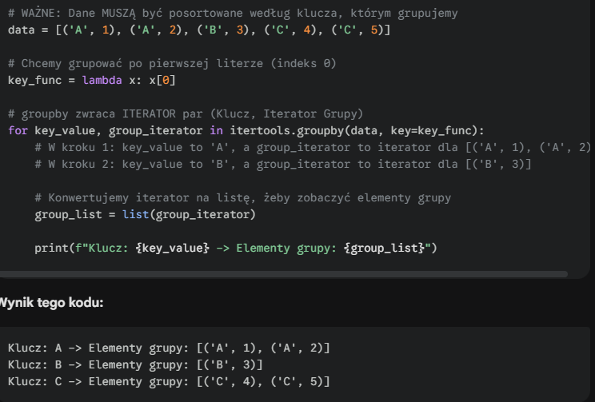

#### <mark style="background: #FFB86CA6;">**itertools.product()**</mark> – <mark style="background: #ABF7F7A6;">`grid search`</mark> – generuje iloczyn kartezjański (wszystkie możliwe kombinacje) sekwencji wejściowych. W ML jest standardem przy tworzeniu siatki hiperparametrów do przetestowania

---

#### <mark style="background: #FFB86CA6;">**itertools.chain()**</mark> – <mark style="background: #ABF7F7A6;">`data streaming`</mark> – łączy wiele iteratorów w jeden ciągły strumień. Pozwala iterować po danych z wielu plików (np. partycji CSV) sekwencyjnie, bez ładowania ich wszystkich naraz do pamięci RAM

---

#### <mark style="background: #FFB86CA6;">**itertools.islice()**</mark> – <mark style="background: #ABF7F7A6;">`mini-batching`</mark> – zwraca wycinek z iteratora na podstawie indeksów (start, stop, krok). Używane do pobierania określonej liczby próbek z generatora danych (np. stworzenie jednego batcha) bez wczytywania reszty datasetu

---

#### <mark style="background: #FFB86CA6;">**itertools.zip_longest()**</mark> – <mark style="background: #ABF7F7A6;">`padding sequences`</mark> – łączy iteratory o nierównej długości, wypełniając braki zdefiniowaną wartością (`fillvalue`). Niezbędne przy przetwarzaniu sekwencji (NLP, Time Series), gdy musimy wyrównać długość wektorów

---

#### <mark style="background: #FFB86CA6;">**itertools.groupby()**</mark> – <mark style="background: #ABF7F7A6;">`preprocessing`</mark> – grupuje kolejne elementy iteratora, które mają ten sam klucz. Wymaga posortowanych danych. Przydatne np. do grupowania logów użytkownika w sesje przed podaniem ich do modelu.

---

combinations permutations count cycle tee