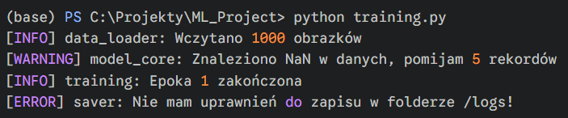
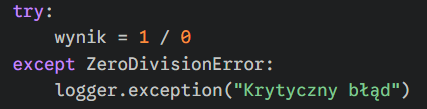
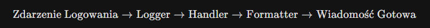
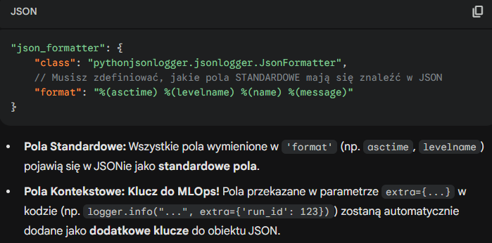

#### <mark style="background: #FFB86CA6;">logging.basicConfig(level=logging.INFO)</mark> - <mark style="background: #ABF7F7A6;">`quick setup`</mark> - Szybka, jednorazowa konfiguracja dla prostych skryptów. Ustawia minimalny poziom logów, które zobaczysz na ekranie.

---

#### <mark style="background: #FFB86CA6;">logger = logging.getLogger(__name__)</mark> - <mark style="background: #ABF7F7A6;">`logger instance`</mark>- Tworzy "nadawcę" wiadomości przypisanego do bieżącego pliku. Użycie `__name__` sprawia, że w logach zobaczysz, z którego pliku pochodzi wiadomość (np. `main.py` czy `data_loader.py`).

---

#### <mark style="background: #FFB86CA6;">logger.debug("wartość x = 5")</mark> - <mark style="background: #ABF7F7A6;">**`diagnostic`** (Poziom 10)</mark> - Szczegóły techniczne potrzebne tylko Tobie przy naprawianiu błędów. Domyślnie ukryte.

#### <mark style="background: #FFB86CA6;">logger.info("Trening rozpoczęty")</mark> - <mark style="background: #ABF7F7A6;">**`confirmation`** (Poziom 20)</mark> - Potwierdzenie, że wszystko idzie zgodnie z planem. Używaj do śledzenia postępów procesu.

#### <mark style="background: #FFB86CA6;">logger.warning("Brak GPU, używam CPU")</mark> - <mark style="background: #ABF7F7A6;">**`alert`** (Poziom 30)</mark> - Coś poszło nie tak, ale program działa dalej. Sygnał, że warto tam zajrzeć, ale to nie awaria.

#### <mark style="background: #FFB86CA6;">logger.error("Nie udało się zapisać pliku")</mark> - <mark style="background: #ABF7F7A6;">**`failure`** (Poziom 40)</mark> - Poważniejszy błąd. Konkretna funkcja nie zadziałała, ale program może próbować robić inne rzeczy.

#### <mark style="background: #FFB86CA6;">logger.critical("Brak połączenia z bazą")</mark> - <mark style="background: #ABF7F7A6;">`fatal`</mark><mark style="background: #ABF7F7A6;"> (Poziom 50)</mark> - Krytyczna awaria. Program nie może dalej działać i zazwyczaj zaraz się wyłączy.

---

#### <mark style="background: #FFB86CA6;">logger.exception("Błąd obliczeń")</mark> - <mark style="background: #ABF7F7A6;">**`traceback`**</mark> - Działa jak `error`, ale **automatycznie dokleja pełną treść błędu** (tzw. stos wywołań). Używaj **tylko** wewnątrz bloku `except`.

---

# Tworzenie dictConfigu - nie ma sensu się uczyć całego, należy pamiętać, że to profesjonalne podejście i wrócić kiedy będzie to potrzebne

---

#### Przepływ logowania

---

#### python-json-logger  - aby logi miały format JSON (przy dictConfig) należy w sekcji "formatters" w konkretny formaterze dodać pole `"class":  "pythonjsonlogger.jsonlogger.JsonFormatter"`

---

