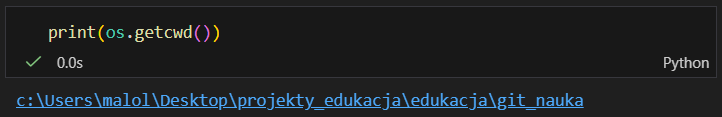
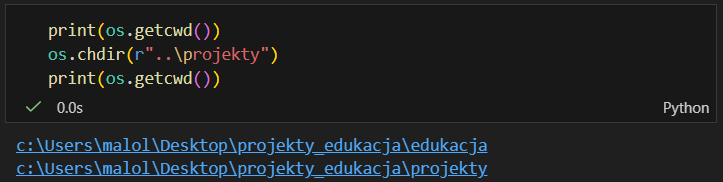
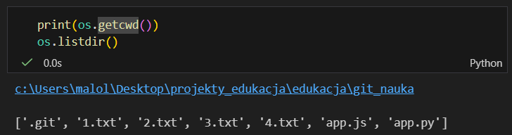
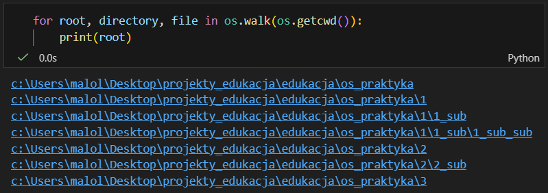
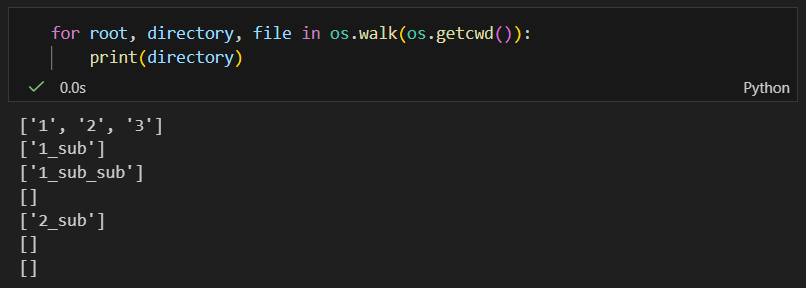
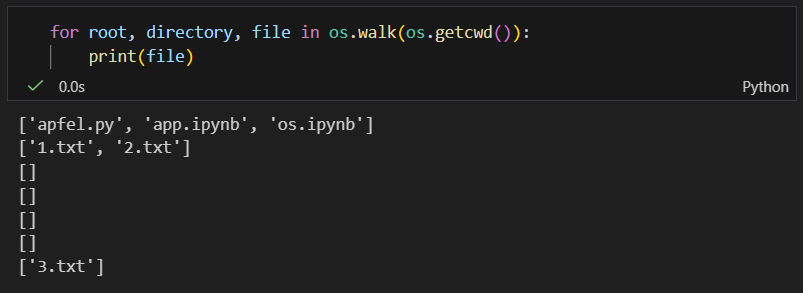

#### <mark style="background: #FFB86CA6;">**<mark style="background: #FF5582A6;">os.getcwd()</mark>** </mark>-  <mark style="background: #ABF7F7A6;">*get current working directory*</mark> - <mark style="background: #FFB86CA6;"></mark>zwraca STRINGA aktualnej ścieżki, na której pracujemy

---

#### <mark style="background: #FFB86CA6;">**os.chdir('*ścieżka `string`*')**</mark> - *<mark style="background: #ABF7F7A6;">change directory</mark>* - nic nie zwraca, zmienia jedynie ścieżkę, w której pracujemy; aby przejść katalog wyżej w argumencie należy podać dwie kropki

---

#### <mark style="background: #FFB86CA6;"> **os.listdir()**</mark> -<mark style="background: #ABF7F7A6;"> *list direction*</mark> - zwraca LISTĘ nazw plików z katalogu, w którym aktualnie się znajdujemy 

---

#### <mark style="background: #FFB86CA6;">**os.walk('*ścieżka `string`*')**</mark> - *<mark style="background: #ABF7F7A6;">przechodzić</mark>* - samo w sobie zwraca generator generujący krotkę/i z trzema wartościami; można przez nie przechodzić pętlą:
- pierwszy element to ścieżka do pliku:
 

- drugi to listy folderów:

- trzeci to listy plików w tych folderach:

---