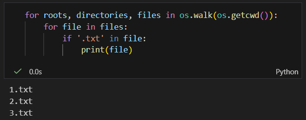
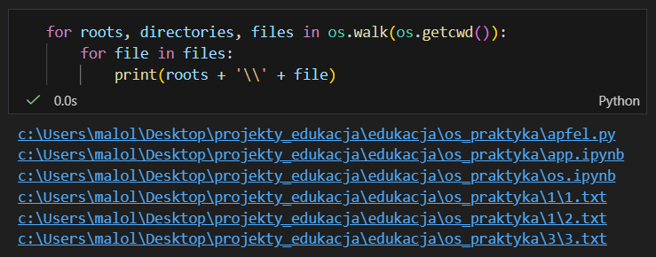
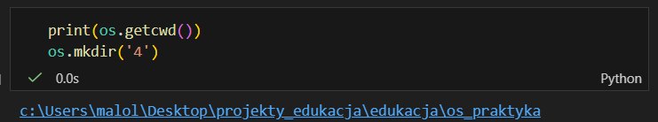
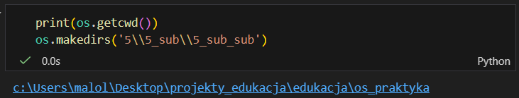
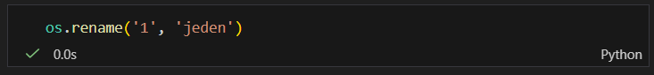
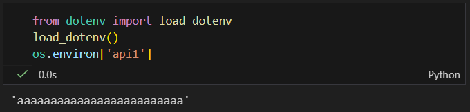
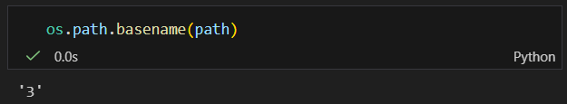
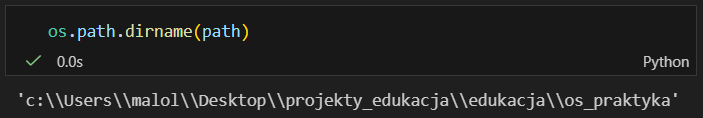

#### <mark style="background: #FFB86CA6;">**<mark style="background: #FF5582A6;">os.getcwd()</mark>** </mark>-  <mark style="background: #ABF7F7A6;">*get current working directory*</mark> - <mark style="background: #FFB86CA6;"></mark>zwraca STRINGA aktualnej ścieżki, na której pracujemy

---

#### <mark style="background: #FFB86CA6;">**os.chdir('*ścieżka `string`*')**</mark> - *<mark style="background: #ABF7F7A6;">change directory</mark>* - nic nie zwraca, zmienia jedynie ścieżkę, w której pracujemy; aby przejść katalog wyżej w argumencie należy podać dwie kropki

---

#### <mark style="background: #FFB86CA6;"> **os.listdir()**</mark> -<mark style="background: #ABF7F7A6;"> *list direction*</mark> - zwraca LISTĘ nazw plików i folderów z folderu, w którym aktualnie się znajdujemy 

---

#### <mark style="background: #FFB86CA6;">**os.walk('*ścieżka `string`*')**</mark> - *<mark style="background: #ABF7F7A6;">przechodzić</mark>* - samo w sobie zwraca generator generujący krotkę/i z trzema wartościami; można przez nie przechodzić pętlą:

- #### pierwszy element to ścieżka do aktualnie przetwarzanego folderu:
 

- #### drugi to listy folderów:

- #### trzeci to listy plików w tych folderach:

#### Można dodawać warunki w pętli, np. odfiltrować puste listy, albo przejść wewnętrzną pętlą przez listy i dodać warunki czy dany element listy zawiera jakiś konkretny ciąg znaków:

#### Kombinując z roots i files można łatwo wygenerować sobie ścieżki do wszystkich plików:

---

#### <mark style="background: #FFB86CA6;">**os.mkdir('*nazwa_folderu `string`*')**</mark> - <mark style="background: #ABF7F7A6;">*make directory*</mark> - tworzy folder  w katalogu, w którym aktualnie się znajdujemy (tylko jeden)

---

#### <mark style="background: #FFB86CA6;">**os.makedirs('*nazwy_folderów_jako_ścieżka `string`*')**</mark> - *<mark style="background: #ABF7F7A6;">make directories</mark>* - to samo co poprzednik, z tą różnicą, że może tworzyć zagnieżdżone struktury

---

#### **<mark style="background: #FFB86CA6;">os.rmdir('*nazwa_folderu `string`*)</mark>** - *<mark style="background: #ABF7F7A6;">remove directory</mark>* - usuwa folder z katalogu, na którym aktualnie pracujemy (tak samo jak w mkdir, usunie tylko jeden, aby usunąć więcej należy użyc <mark style="background: #FFB86CA6;">**os.removedirs('*nazwy_folderów_jako_ścieżka `string`*)**</mark> - *<mark style="background: #ABF7F7A6;">remove directories</mark>*)

---

<mark style="background: #FFB86CA6;">**os.rename('nazwa_do_zmiany', 'nazwa_na_którą_zmieni' `string`)**</mark> - <mark style="background: #ABF7F7A6;">*przezwij*</mark> - zmienia nazwę folderu o podanej nazwie na nazwę podaną w drugim argumencie

---

#### **os.stat('nazwa_pliku' `*string*`)** - *statistics* - zwraca obiekt klasy, który opisuje statystyki pliku, którego nazwa została przekazana w argumencie

| **Atrybut**      | **Opis**                                                                                                                                                                                         |
| ---------------- | ------------------------------------------------------------------------------------------------------------------------------------------------------------------------------------------------ |
| **`st_mode`**    | Tryb ochrony pliku (np. uprawnienia i typ pliku, np. katalog, zwykły plik). Jest to pole bitowe.                                                                                                 |
| **`st_ino`**     | Numer **i-węzła** (inode) urządzenia, na którym znajduje się plik.                                                                                                                               |
| **`st_dev`**     | Identyfikator urządzenia, na którym plik jest rezydentny.                                                                                                                                        |
| **`st_nlink`**   | Liczba twardych (trwałych) dowiązań do pliku.                                                                                                                                                    |
| **`st_uid`**     | Identyfikator użytkownika (User ID - **UID**) właściciela pliku.                                                                                                                                 |
| **`st_gid`**     | Identyfikator grupy (Group ID - **GID**) właściciela pliku.                                                                                                                                      |
| **`st_size`**    | Rozmiar pliku w **bajtach**. Dla niektórych typów plików (np. FIFO, gniazda) znaczenie może być inne.                                                                                            |
| **`st_atime`**   | Czas **ostatniego dostępu** do pliku, wyrażony jako liczba sekund od Epoki (zazwyczaj 1 stycznia 1970).                                                                                          |
| **`st_mtime`**   | Czas **ostatniej modyfikacji** zawartości pliku, wyrażony w sekundach od Epoki.                                                                                                                  |
| **`st_ctime`**   | Czas **ostatniej zmiany metadanych** pliku (np. uprawnień, właściciela) w systemach uniksopodobnych (np. Linux) lub **czas utworzenia** pliku w systemie Windows, wyrażony w sekundach od Epoki. |
| **`st_blocks`**  | (Dostępne na niektórych systemach) Liczba bloków po 512 bajtów przydzielonych dla pliku.                                                                                                         |
| **`st_blksize`** | (Dostępne na niektórych systemach) Preferowany rozmiar bloku dla operacji wejścia/wyjścia.                                                                                                       |
| **`st_rdev`**    | (Dostępne dla plików specjalnych urządzeń) Identyfikator urządzenia, jeśli plik jest plikiem specjalnym urządzenia (blokowym lub znakowym).                                                      |

---

#### **os.environ['klucz' *`string`*]** - *environment* - obiekt, który zachowuje się jak słownik i przechowuje zmienne środowiskowe. 

Za jego pomocą można pobierać zmienne z pliku `.env` bezpośrednio albo za pomocą metody **get()**

---

os.path.basename('sciezka')

---

os.path.dirname('sciezka')

---

os.path.split('ścieżka)

![[path_split.png]]