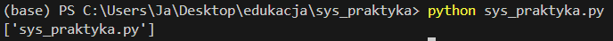
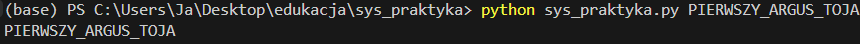
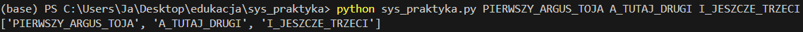
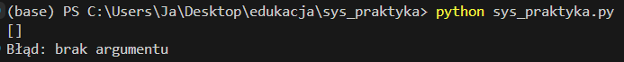
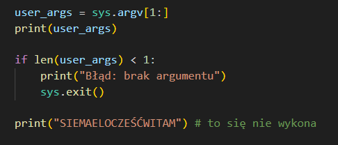
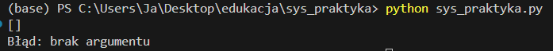
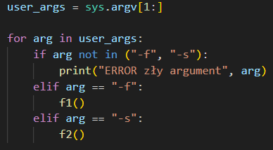

#### <mark style="background: #FFB86CA6;">**sys.argv**</mark> - <mark style="background: #ABF7F7A6;">`argument values`</mark> - lista stringów zawierająca argumenty podane w terminalu; element `[0]` to zawsze nazwa uruchamianego skryptu

---

#### **<mark style="background: #FFB86CA6;">sys.argv[n]</mark>** - <mark style="background: #ABF7F7A6;">`index access`</mark> - pobranie konkretnego argumentu z listy; `[1]` to pierwszy argument podany przez użytkownika

---

#### <mark style="background: #FFB86CA6;">**sys.argv[1:]**</mark> - <mark style="background: #ABF7F7A6;">`list slicing`</mark> - wycina z listy nazwę skryptu, zostawiając tylko argumenty użytkownika; idealne do iteracji w pętli

---

#### <mark style="background: #FFB86CA6;">**len(sys.argv)**</mark> - <mark style="background: #ABF7F7A6;">`length check`</mark> - dobra praktyka; sprawdza długość listy argumentów; służy do walidacji, czy użytkownik podał wymagane dane

---

#### <mark style="background: #FFB86CA6;">**sys.exit()**</mark> - <mark style="background: #ABF7F7A6;">`system exit`</mark> - natychmiast przerywa działanie programu

---

#### <mark style="background: #FFB86CA6;">**Iteracja pętlą for**</mark> - <mark style="background: #ABF7F7A6;">`argument loop`</mark> - pozwala obsłużyć wiele niezależnych flag w jednym uruchomieniu; przechodzimy przez listę argumentów i sprawdzamy każdy po kolei; możemy kombinować z logiką zmieniając/dodając ify

---

