**Type Hinting** – `kontrola przepływu / self-doc` – w nowoczesnym ML to fundament, który eliminuje błędy typu **NoneType** przy ładowaniu modeli oraz pozwala na natychmiastowe wykrycie niezgodności między strukturami danych bez uruchamiania ciężkich skryptów treningowych

---

#### <mark style="background: #FFB86CA6;">**list / dict / tuple**</mark> – <mark style="background: #ABF7F7A6;">`wbudowane (3.9+)`</mark> – Od Pythona 3.9 **nie importujemy** już `List`, `Dict`, `Tuple` z modułu `typing`. Używamy małych liter (built-ins). W ML kluczowe do czystego definiowania **hiperparametrów**, **historii strat (loss)** czy **wymiarów obrazów**, bez zaśmiecania sekcji importów. 

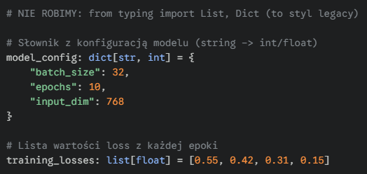listy.png)

---

#### <mark style="background: #FFB86CA6;">**| (Union Operator)**</mark> – <mark style="background: #ABF7F7A6;">`logika / null-safety (3.10+)`</mark> – Zastępuje przestarzałe `Union` oraz `Optional`. W ML absolutnie niezbędne do obsługi **opcjonalnych ścieżek do wag (checkpoint loading)** lub funkcji, które mogą przyjąć pojedynczy element albo całą listę (np. przy predykcji). Uwaga na None  = None, to pierwsze None to typ danych a drugie None to wartość, czyli dwa różne nony xd

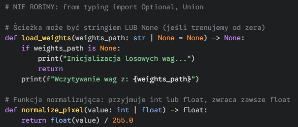

---

#### <mark style="background: #FFB86CA6;">**typing.Callable**</mark> – <mark style="background: #ABF7F7A6;">`funkcje wyższego rzędu`</mark> – **Wymaga importu**. Służy do typowania funkcji przekazywanych jako argumenty. W ML kluczowe przy tworzeniu **elastycznych pętli treningowych**, gdzie chcemy dynamicznie podmieniać **funkcje aktywacji**, **metryki** (np. accuracy vs f1) czy **transformacje danych**.

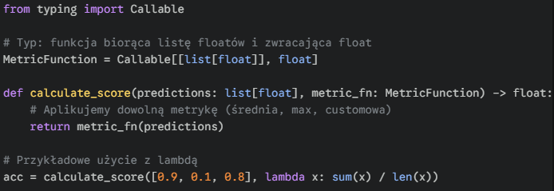

---

#### <mark style="background: #FFB86CA6;">**typing.Iterable**</mark> – <mark style="background: #ABF7F7A6;">`abstrakcja / lazy loading`</mark> – **Wymaga importu**. Używamy, gdy funkcji nie obchodzi, czy dostanie listę, krotkę czy generator. W ML krytyczne przy **dużych datasetach**, których nie chcemy wczytywać całych do RAM-u – pozwala funkcji obsłużyć **generator danych (yield)** tak samo jak zwykłą listę.

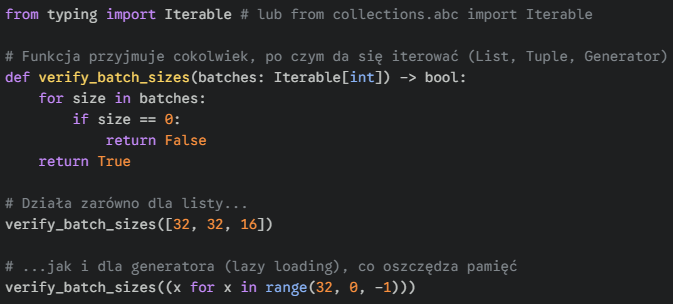

---

#### <mark style="background: #FFB86CA6;">**np.ndarray / torch.Tensor**</mark> – <mark style="background: #ABF7F7A6;">`typy biblioteczne`</mark> – **Wymaga importu biblioteki**. Jako Junior nie musisz używać skomplikowanych bibliotek do typowania kształtów (jak `jaxtyping`), ale **nigdy** nie typuj tensorów jako `list`. Musisz wyraźnie wskazać, że operujesz na obiektach wektorowych NumPy lub PyTorch.

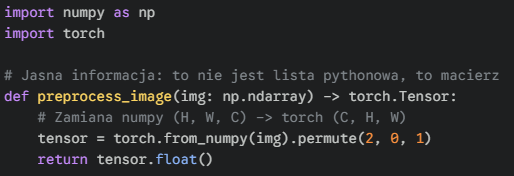

---

#### <mark style="background: #FFB86CA6;">**typing.Any**</mark> – <mark style="background: #ABF7F7A6;">`ostateczność / czerwona flaga`</mark> – **Wymaga importu**. Oznacza brak jakichkolwiek restrykcji co do typu. W ML używamy tylko wtedy, gdy dane pochodzą z bardzo nieprzewidywalnych źródeł (np. surowe JSON-y z API). Jako Junior dąż do jego eliminacji – nadmiar `Any` sprawia, że typing przestaje pełnić funkcję ochronną.

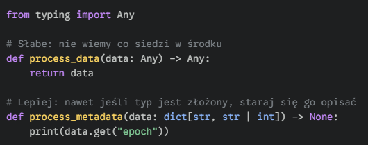

---

#### <mark style="background: #FFB86CA6;">**typing.Literal**</mark> – <mark style="background: #ABF7F7A6;">`bezpieczeństwo / konfiguracja`</mark> – **Wymaga importu**. Ogranicza zmienną do konkretnych, sztywnych wartości (zazwyczaj stringów). W ML kluczowe przy wyborze **trybu pracy modelu** (train/eval), **architektury** (resnet18/resnet50) czy **rodzaju optymalizatora**, eliminując błędy typu "runtime error" spowodowane literówką.

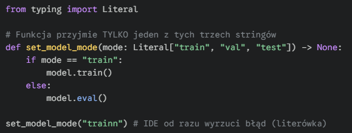

---

#### <mark style="background: #FFB86CA6;">**Sequence vs Iterable**</mark> – <mark style="background: #ABF7F7A6;">`dostęp do danych`</mark> – **Wymaga importu**. `Iterable` pozwala tylko na przejście pętlą (np. generator), `Sequence` pozwala dodatkowo na sprawdzanie długości `len()` i dostęp przez indeks `data[0]`. W ML używaj `Sequence`, gdy potrzebujesz np. **losować próbki** (shuffling) z listy ścieżek do obrazów.

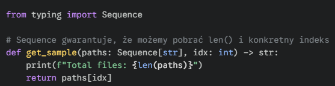

---

#### <mark style="background: #FFB86CA6;">**Type Aliasing**</mark> – <mark style="background: #ABF7F7A6;">`czytelność / reużywalność`</mark> – **Wbudowane**. W ML typy bywają tasiemcami (np. słowniki tensorów). Zamiast kopiować złożone struktury, tworzymy alias. Pozwala to na błyskawiczną zmianę definicji danych w całym projekcie (np. przejście z `float32` na `float16`) w jednym miejscu.

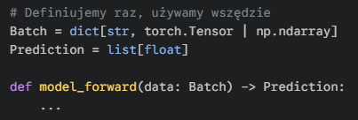

---

#### <mark style="background: #FFB86CA6;">**typing.Annotated**</mark> – <mark style="background: #ABF7F7A6;">`dokumentacja w kodzie`</mark> – **Wymaga importu (3.9+)**. Pozwala "dokleić" metadane do typu bez wpływu na logikę. W ML genialne do oznaczania **jednostek** (np. sekundy vs ms) lub **wymogów hiperparametrów** (np. learning rate musi być dodatni), co jest czytane przez narzędzia typu Pydantic.

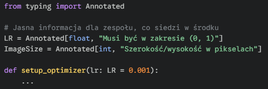

---

#### <mark style="background: #FFB86CA6;">**Komentarze Kształtu (# shape)**</mark> – <mark style="background: #ABF7F7A6;">`debugging tensorów`</mark> – **Standard rynkowy**. Ponieważ `np.ndarray` nie mówi, czy masz wektor, czy obraz 4K, Juniorzy powinni dopisywać kształt w komentarzu. To "ludzki typing", który ratuje życie podczas operacji na macierzach (mnożenie, transpozycja), zanim przejdziesz na zaawansowane biblioteki.

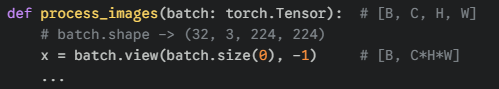

---